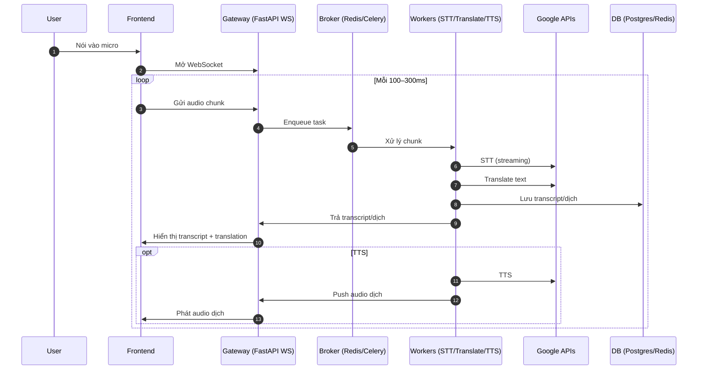

# 🌐 Web Dịch Realtime – Tổng hợp Tài liệu

---

# 1) TÓM TẮT CÁCH TIẾP CẬN (Speech-to-Text + Dịch + Phát lại)

## Trải nghiệm người dùng (UX)
- Người dùng bật micro → gửi audio chunk (100–300ms) qua WebSocket.
- Nhận transcript tạm (interim) và transcript cuối (final).
- Dịch đồng thời (interim và final).
- (Tuỳ chọn) phát lại giọng dịch bằng TTS.

**Best practices**
- Chunk audio 100–300ms thay vì gửi file dài.
- Hiển thị trạng thái: “đang nghe…”, “đang dịch…”, “đang phát…”.
- Cho phép chọn ngôn ngữ nguồn/đích và đổi nhanh không cần reload.

## Công nghệ cốt lõi
- **Frontend**: Next.js/React + WebSocket/WebRTC (MediaRecorder).
- **Gateway**: FastAPI (ASGI) + Uvicorn (WebSocket endpoint).
- **Workers**: Python Celery → Google STT + Translate + (TTS).
- **Broker**: Redis (MVP), Kafka/NATS (scale lớn).
- **DB**: PostgreSQL (lưu lịch sử), Redis (cache dịch, session).
- **Triển khai**: Docker + Kubernetes (autoscale).

**Best practices**
- Chuẩn hoá audio 16kHz mono PCM.
- Ưu tiên streaming API để có kết quả nhanh.
- Dùng idempotency key cho mỗi chunk/câu.

## Luồng xử lý chính (Mermaid)



**Best practices**
- Phân biệt interim/final bằng flag `status`.
- Ghi offset thời gian để đồng bộ phụ đề và audio dịch.
- Thêm backpressure khi nghẽn.

---

# 2) KIẾN TRÚC HỆ THỐNG HOÀN CHỈNH

## Thành phần chính
1. **Frontend (Next.js/React)**
   - Ghi âm micro, gửi audio chunk qua WebSocket.
   - Hiển thị transcript & dịch realtime.
   - (Tuỳ chọn) phát audio TTS.

2. **Gateway API (FastAPI, Uvicorn, ASGI)**
   - Xử lý kết nối WebSocket cho nhiều client.
   - Đẩy chunk audio vào hàng đợi (Redis/Celery hoặc Kafka/NATS).
   - Trả transcript/dịch về client theo session_id.

3. **Worker Services (Celery Workers)**
   - **STT Worker**: Gọi Google STT API (streaming).
   - **Translation Worker**: Gọi Google Translate API / LLM.
   - **TTS Worker**: Gọi Google TTS → trả audio.

4. **Message Broker**
   - MVP: Redis + Celery (nhanh, dễ setup).
   - Scale: Kafka/NATS (throughput cao, replay, partitioning).

5. **Database Layer**
   - **PostgreSQL**: Lưu transcripts, translations, metadata phiên dịch.
   - **Redis**: Cache dịch, lưu session ephemeral.

6. **Infra**
   - Docker + Kubernetes (autoscaling).
   - Ingress (Nginx/Envoy).
   - Observability: Prometheus + Grafana.

---

## Flow hệ thống chi tiết

```mermaid
flowchart LR
    subgraph FE [Frontend]
        A[Microphone] --> B[Web App (Next.js)]
        B -->|Audio Chunk 100-300ms| C[WebSocket]
    end

    subgraph GW [Gateway FastAPI]
        C --> D[Session Manager]
        D --> E[Task Dispatcher]
    end

    subgraph MQ [Message Broker]
        E --> F[(Redis Queue)]
    end

    subgraph WK [Workers]
        F --> G[STT Worker]
        G --> H[Translation Worker]
        H --> I[TTS Worker]
    end

    subgraph EXT [Google APIs]
        G --> J[Google STT API]
        H --> K[Google Translate API]
        I --> L[Google TTS API]
    end

    subgraph DB [Data Layer]
        H --> M[(Postgres)]
        G --> M
        H --> N[(Redis Cache)]
    end

    I --> GW
    H --> GW
    GW --> FE
```

---

## Best practices khi triển khai
- Tách **service nhỏ (STT/Translate/TTS)** để dễ autoscale.
- Dùng **session_id** + **chunk_id** để tracking và đảm bảo thứ tự.
- Giới hạn độ dài audio chunk → giảm độ trễ và tránh timeout API.
- Dùng **connection pool** khi gọi API Google để giảm overhead.
- Ghi log toàn bộ events → Prometheus metrics để giám sát.
- Cache dịch ngắn hạn (5–30s) để tránh dịch lại khi interim/final trùng.
- Với hội nghị hàng ngàn người → dùng Kafka để phân vùng (partition) theo session.

---
