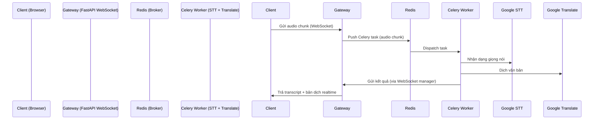

# 🔄 Flow mẫu: Realtime Translation với Redis + Celery

## 1. Kiến trúc tổng thể


---

## 2. Code mẫu

### 2.1. Cấu hình Celery (app/celery_app.py)
```python
from celery import Celery

celery_app = Celery(
    "realtime_translator",
    broker="redis://localhost:6379/0",
    backend="redis://localhost:6379/1"
)

celery_app.conf.task_routes = {
    "tasks.process_audio": {"queue": "audio"}
}
```

### 2.2. Worker xử lý (app/tasks.py)
```python
from .celery_app import celery_app
import requests

GOOGLE_STT_API = "https://speech.googleapis.com/v1/speech:recognize"
GOOGLE_TRANSLATE_API = "https://translation.googleapis.com/language/translate/v2"
API_KEY = "YOUR_GOOGLE_API_KEY"

@celery_app.task
def process_audio(audio_chunk: bytes, session_id: str, target_lang: str):
    stt_payload = {
        "config": {"encoding": "LINEAR16", "languageCode": "en-US"},
        "audio": {"content": audio_chunk.decode("latin1")}
    }
    stt_resp = requests.post(
        f"{GOOGLE_STT_API}?key={API_KEY}", json=stt_payload
    ).json()
    transcript = stt_resp.get("results", [{}])[0].get("alternatives", [{}])[0].get("transcript", "")

    trans_payload = {
        "q": transcript,
        "target": target_lang,
        "format": "text",
        "key": API_KEY
    }
    trans_resp = requests.post(GOOGLE_TRANSLATE_API, data=trans_payload).json()
    translated_text = trans_resp.get("data", {}).get("translations", [{}])[0].get("translatedText", "")

    requests.post("http://gateway:8000/ws_callback", json={
        "session_id": session_id,
        "original": transcript,
        "translated": translated_text
    })
```

### 2.3. FastAPI WebSocket Gateway (app/main.py)
```python
from fastapi import FastAPI, WebSocket, WebSocketDisconnect
from app.tasks import process_audio
import base64

app = FastAPI()
active_connections = {}

@app.websocket("/ws/{session_id}")
async def websocket_endpoint(ws: WebSocket, session_id: str):
    await ws.accept()
    active_connections[session_id] = ws
    try:
        while True:
            data = await ws.receive_bytes()
            audio_b64 = base64.b64encode(data).decode("latin1")
            process_audio.delay(audio_b64, session_id, target_lang="vi")
    except WebSocketDisconnect:
        active_connections.pop(session_id, None)

@app.post("/ws_callback")
async def ws_callback(payload: dict):
    session_id = payload["session_id"]
    ws = active_connections.get(session_id)
    if ws:
        await ws.send_json({
            "original": payload["original"],
            "translated": payload["translated"]
        })
    return {"status": "ok"}
```

---

## 3. Luồng hoạt động
1. Client mở WebSocket `/ws/{session_id}` → gửi audio chunk.  
2. FastAPI Gateway push audio vào Celery task.  
3. Celery Worker gọi **Google STT** → transcript.  
4. Worker gọi **Google Translate** → bản dịch.  
5. Worker POST lại về Gateway `/ws_callback`.  
6. Gateway forward transcript + dịch đến client WebSocket.  

---

## 4. Ưu & Nhược
- ✅ Đơn giản, dễ triển khai ban đầu.  
- ✅ Redis + Celery dễ mở rộng bằng cách tăng worker.  
- ❌ Latency cao hơn Kafka/NATS (có thể vài trăm ms).  
- ❌ Khó tối ưu với streaming audio dài liên tục.  

---

👉 Đây là pipeline mẫu, bạn có thể tối ưu thêm:
- Dùng **WebSocket trực tiếp giữa Worker ↔ Client** (bỏ bước callback để giảm latency).  
- Chunk audio nhỏ hơn (200ms–500ms) để transcript realtime.  
- Sử dụng **Redis pub/sub** thay vì REST callback để nhanh hơn.  
