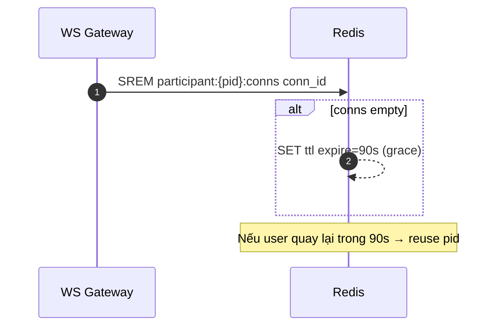

Bạn đang cho khách join conference **không đăng nhập**, chỉ nhập tên. Bài toán là: làm sao **định danh ổn định**, **không đếm trùng** khi mở nhiều tab/ẩn danh, và **xử lý rejoin** mà không coi là người mới. Dưới đây là cách làm “chuẩn hệ thống lớn” bạn có thể áp dụng.

# 🧭 Nguyên tắc tổng quát

* **Không có login ⇒ không có danh tính mạnh.** Mục tiêu là tạo **định danh thiết bị/phiên (device/session)** đủ ổn để:

  1. quản lý presence & quyền trong conference,
  2. không “đếm trùng” khi mở nhiều tab,
  3. cho phép **resume** khi user rớt mạng/refresh.
* **Phân tầng định danh** (progressive identity):

  * **Tier 0 – Anonymous**: device\_id sinh ra client-side + cookie/IndexedDB, gửi kèm name.
  * **Tier 1 – Magic link/Email OTP** *(tuỳ chọn)*: mạnh hơn, chống multi-browser tốt hơn.
  * **Tier 2 – Login account** *(tuỳ chọn)*: danh tính mạnh nhất, dùng cho phòng VIP/billing nghiêm ngặt.

# 🧩 Thiết kế thực dụng cho Anonymous

## 1) Cách tạo định danh khách (không login)

* Khi user mở link join:

  * Backend set **HttpOnly cookie `did`** (device\_id) nếu chưa có.
  * FE tạo **khoá cặp** bằng Web Crypto, lưu **publicKey** trong **IndexedDB** (ổn định hơn localStorage, không chia sẻ cross-origin).
    → Gửi `pubkey_fingerprint` lên server **một lần**.
* Server phát hành **JWT join token** (ký RS256) chứa:

  ```json
  {
    "cid": "conference_id",
    "role": "guest",
    "did": "hash(device_id)",
    "pkf": "pubkey_fingerprint",
    "exp": 1730000000,
    "ver": 1
  }
  ```

  * Dùng `did` + `pkf` để “gắn” một participant ổn định trong phạm vi conference.

> 📌 Lưu ý: **Incognito** là sandbox → cookie/IndexedDB reset ⇒ **không thể** đảm bảo là “một người” nếu họ cố mở nhiều cửa sổ ẩn danh khác nhau. Không nền tảng lớn nào đảm bảo 100% khi **không login**. Ta chỉ **giảm thiểu** (rate-limit, captcha, quota per-IP, per-invite).

## 2) Chống đếm trùng khi mở nhiều tab

* FE mở nhiều tab ⇒ tất cả cùng `did`/`pkf`.
* Dùng **BroadcastChannel** hoặc **SharedWorker** tên `conf-{cid}` để **điều phối tab**:

  * Tab “chính” = **publisher** (được quyền mở mic/WebRTC).
  * Các tab phụ = **subscriber** (listen-only, **không** tạo upstream audio).
  * Nếu tab chính đóng, bầu lại tab chính (simple leader election qua BroadcastChannel).
* Trên server:

  * Mỗi WS connection có `conn_id`.
  * Map: `participant_id` → **set** các `conn_id`.
  * **Đếm người** = **số participant (unique)**, **không phải** số connection.
  * Khi `conn_id` của cùng `participant_id` > 1 ⇒ **không tăng** participant count.

## 3) Rejoin/Refresh không tính người mới

* **Grace timer**: Khi tất cả `conn_id` của participant rớt, **đợi 60–120s** trước khi loại khỏi `participants_set`.

  * Nếu họ refresh/rejoin trong khoảng này ⇒ **resume** participant cũ, **không** tăng đếm.
* **Resume token**: JWT kèm `sid` (server-side `participant_id`) để **ghép lại** cùng participant nếu quay lại sau ngắn hạn.
* **Presence**:

  * Ping/heartbeat mỗi 10–20s (WS ping/pong).
  * Nếu timeout → đánh dấu **soft-offline** rồi mới xoá sau grace period.

## 4) Redis data model (đơn giản, hiệu quả)

```text
# Thông tin conference
conf:{cid}:participants              -> SET of participant_id
conf:{cid}:participant:{pid}:conns   -> SET of conn_id
conf:{cid}:participant:{pid}:meta    -> HASH { name, did, pkf, joined_at, last_seen }

# Grace/disconnect tracking
conf:{cid}:participant:{pid}:ttl     -> key with expiry (grace window)

# Analytics (tuỳ)
conf:{cid}:metrics:unique_daily      -> HLL or SET per day for unique devices
```

**Luồng cập nhật:**

* On WS connect:

  1. Resolve `pid` từ (`cid`, `did`, `pkf`). Nếu chưa có → tạo `pid`.
  2. `SADD conf:{cid}:participants pid` (nếu lần đầu).
  3. `SADD conf:{cid}:participant:{pid}:conns conn_id`
  4. Xoá `ttl` nếu tồn tại (huỷ grace).
* On WS disconnect:

  1. `SREM conf:{cid}:participant:{pid}:conns conn_id`
  2. Nếu set conns rỗng → set `ttl` (expire 60–120s).
  3. Khi `ttl` hết hạn → `SREM conf:{cid}:participants pid`.

## 5) Định nghĩa “Unique” theo ngữ cảnh (rất quan trọng)

* **Concurrent unique**: |`conf:{cid}:participants`| (đã loại trùng nhiều tab).
* **Unique per event (billing)**: distinct `pid` trong khung thời gian event (HLL/SET).
* **Unique per device/day**: distinct `did` per day (HLL) cho analytics.

## 6) Chống abuse & spam

* **CAPTCHA nhẹ** khi join public room.
* **Rate limit** theo IP / `did` / `cid` (Sliding window).
* **Quota**: số join/giờ trên cùng `did`.
* **Invite JWT**: `aud` = cid, `max_joins`, `exp` ngắn, **không** để token “vĩnh viễn”.
* **Turnstile** (Cloudflare) tại edge nếu mở công khai.

## 7) Best practices (tóm tắt)

* **Không đếm connection, đếm participant** (gom các tab của cùng `pid`).
* **Grace period** để “hấp thụ” rớt mạng/refresh.
* **Tab coordinator** (BroadcastChannel/SharedWorker) để chỉ **một tab** publish mic.
* **JWT join** gắn `cid` + `did` + `pkf` + `exp` (ngắn).
* **Redis SET** + **TTL** cho presence, **HLL** cho thống kê unique tiết kiệm RAM.
* **Nói rõ giới hạn**: Ẩn danh ≠ danh tính mạnh. Incognito khác profile ⇒ có thể bị đếm là người khác. Muốn chắc chắn → dùng **magic link** hoặc **login**.

---

# 🛠️ Flow chi tiết (Mermaid)

## A) Join & đặt tên (không login)

```mermaid
sequenceDiagram
  autonumber
  participant U as User
  participant FE as Frontend
  participant BE as Backend
  participant R as Redis

  U->>FE: Mở link join?cid=ABC
  FE->>BE: GET /join/bootstrap (no creds)
  BE-->>FE: Set-Cookie did=... (HttpOnly); issue nonce
  FE->>FE: Tạo keypair; lưu pk fingerprint (IndexedDB)
  FE->>BE: POST /join/authorize {cid, name, pkf, nonce}
  BE->>R: Upsert device record (did, pkf)
  BE-->>FE: join_jwt {cid, did, pkf, exp} + sid (participant_id)
```

## B) WebSocket & chống đếm trùng tab

```mermaid
sequenceDiagram
  autonumber
  participant FE as Frontend (tabs)
  participant CO as Tab Coordinator
  participant GW as WS Gateway
  participant R as Redis

  FE->>CO: BroadcastChannel('conf-ABC') - elect publisher tab
  FE->>GW: WS connect w/ join_jwt
  GW->>R: Resolve pid from (cid,did,pkf); SADD participants pid
  GW->>R: SADD participant:{pid}:conns conn_id; DEL ttl
  alt Multiple tabs same pid
    note over GW: count participant once
  end
  CO->>FE: Only leader publishes mic; others listen-only
```

## C) Disconnect & Rejoin (không tính người mới)



---

# 📦 “Nâng cấp” khi cần mạnh hơn

* **Magic link** (Tier 1): gửi link qua email/SMS → mỗi link gắn `invite_id`, `cid`, `exp`, `max_joins=1..n`. Unique theo **người mời** thay vì “thiết bị”.
* **Login (Tier 2)**: bắt buộc với phòng trả phí hoặc cần audit. Unique theo **user\_id**.

---

## ✅ Kết luận nhanh

* Ở chế độ **không đăng nhập**, best practice là:

  1. **Device fingerprint nhẹ** (`did` cookie + `pkf` IndexedDB),
  2. **JWT join** ràng buộc `cid/did/pkf`,
  3. **Presence trên Redis** (SET participants, SET conns/participant, TTL grace),
  4. **Tab coordination** để **không đếm trùng** và **giảm tải audio**,
  5. **Định nghĩa rõ ràng** “unique” cho đếm người / billing / analytics.
* Cần “chắc chắn” hơn ⇒ thêm **magic link** hoặc **login**.

Nếu bạn muốn, mình có thể đóng gói phần này thành **tài liệu .md để tải về** (kèm mẫu payload, Redis keys, và snippet code WS connect/disconnect).
